---
## Author
author:
  name: Калашникова Ольга Сергеевна
  degrees: DSc
  orcid: 0000-0002-0877-7063
  email: kulyabov-ds@rudn.ru
  affiliation:
    - name: Российский университет дружбы народов
      country: Российская Федерация
      postal-code: 117198
      city: Москва
      address: ул. Миклухо-Маклая, д. 6
## Title
title: Отчёт по лабораторной работе №1
subtitle: Математическое моделирование
license: CC BY
date: today
date-format: "2025-06-14" # Example: 2025-09-06
---

# Вводная часть

## Цель работы

Целью данной работы является подготовка рабочего пространства для выполнения программ и приобретение необходимых навыков создания и преобразования программ на Julia

# Выполнение лабораторной работы

## Создание проекта DrWatson для лабораторных

{#fig-001 width=70%}

## Создание проекта DrWatson для лабораторных

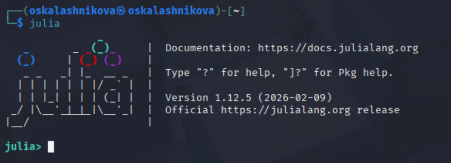{#fig-002 width=70%}

## Создание проекта DrWatson для лабораторных

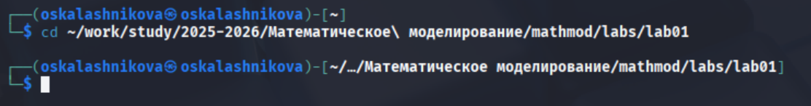{#fig-003 width=70%}

## Создание проекта DrWatson для лабораторных

{#fig-004 width=70%}

## Создание проекта DrWatson для лабораторных

{#fig-005 width=70%}

## Создание проекта DrWatson для лабораторных

{#fig-006 width=70%}

## Создание проекта DrWatson для лабораторных

{#fig-007 width=70%}

## Создание проекта DrWatson для лабораторных

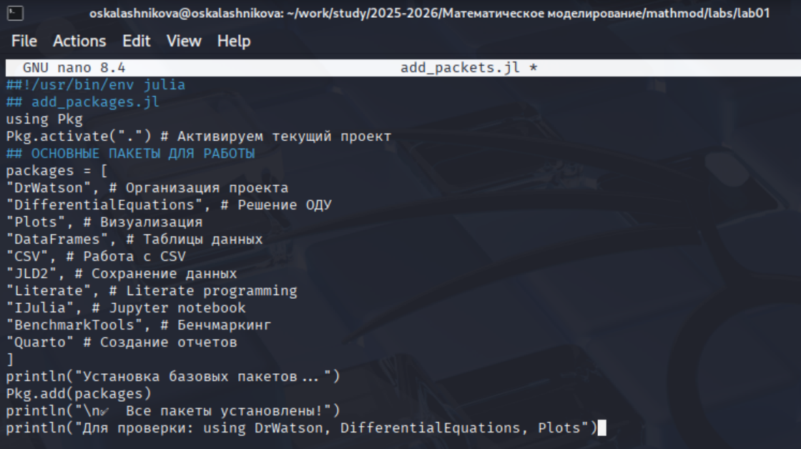{#fig-008 width=70%}

## Создание проекта DrWatson для лабораторных

{#fig-009 width=70%}

## Создание проекта DrWatson для лабораторных

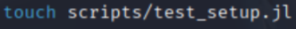{#fig-010 width=70%}

## Создание проекта DrWatson для лабораторных

{#fig-011 width=50%}

## Создание проекта DrWatson для лабораторных

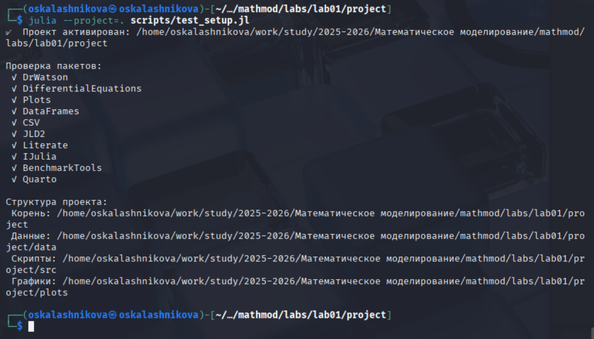{#fig-012 width=70%}

## Создание проекта DrWatson для лабораторных

{#fig-013 width=50%}

## Модель экспоненциального роста

{#fig-014 width=70%}

## Модель экспоненциального роста

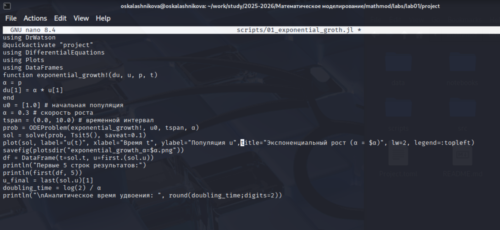{#fig-015 width=70%}

## Модель экспоненциального роста

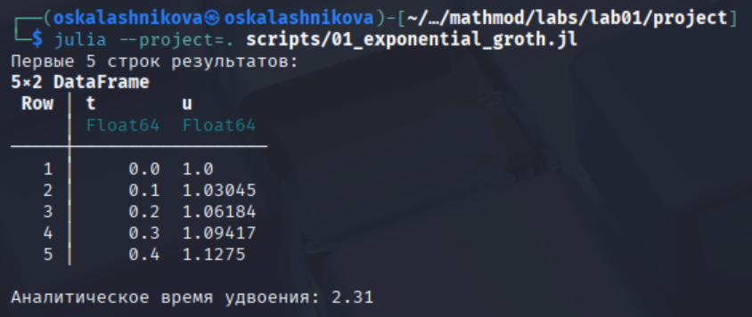{#fig-016 width=70%}

## Модель экспоненциального роста

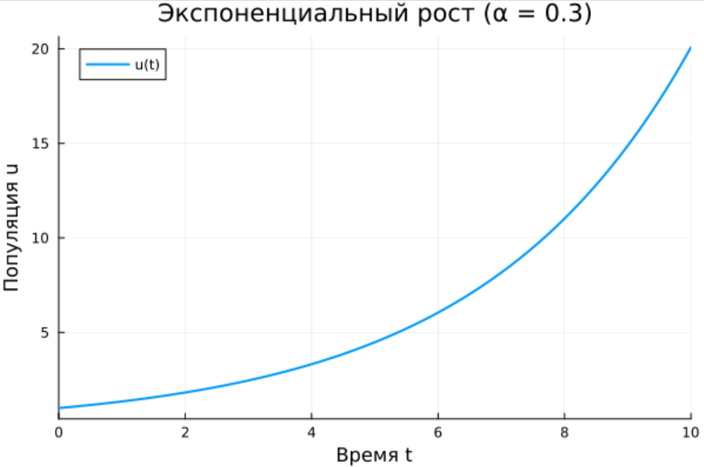{#fig-017 width=60%}

## Модель экспоненциального роста

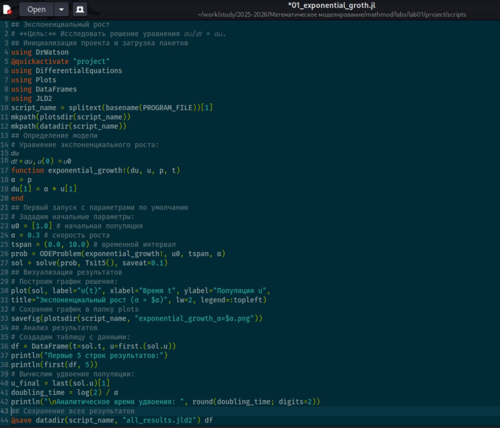{#fig-018 width=50%}

## Модель экспоненциального роста

{#fig-019 width=70%}

## Модель экспоненциального роста

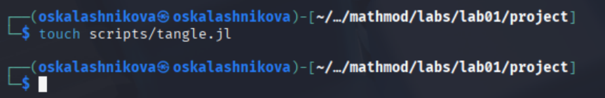{#fig-020 width=70%}

## Модель экспоненциального роста

{#fig-021 width=50%}

## Модель экспоненциального роста

{#fig-022 width=70%}

## Модель экспоненциального роста

{#fig-023 width=50%}

## Модель экспоненциального роста

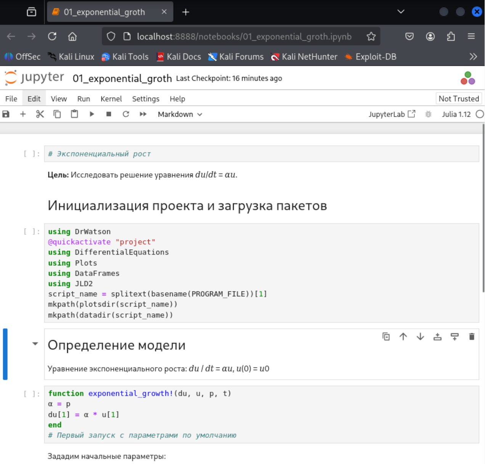{#fig-024 width=40%}

## Модель экспоненциального роста

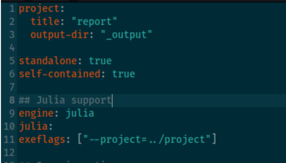{#fig-025 width=70%}

## Модель экспоненциального роста

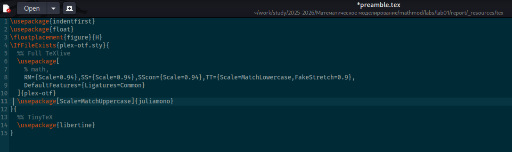{#fig-026 width=70%}

## Модель экспоненциального роста

{#fig-027 width=70%}

## Модель экспоненциального роста

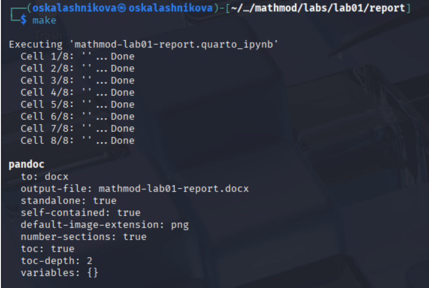{#fig-028 width=60%}

## Модель экспоненциального роста

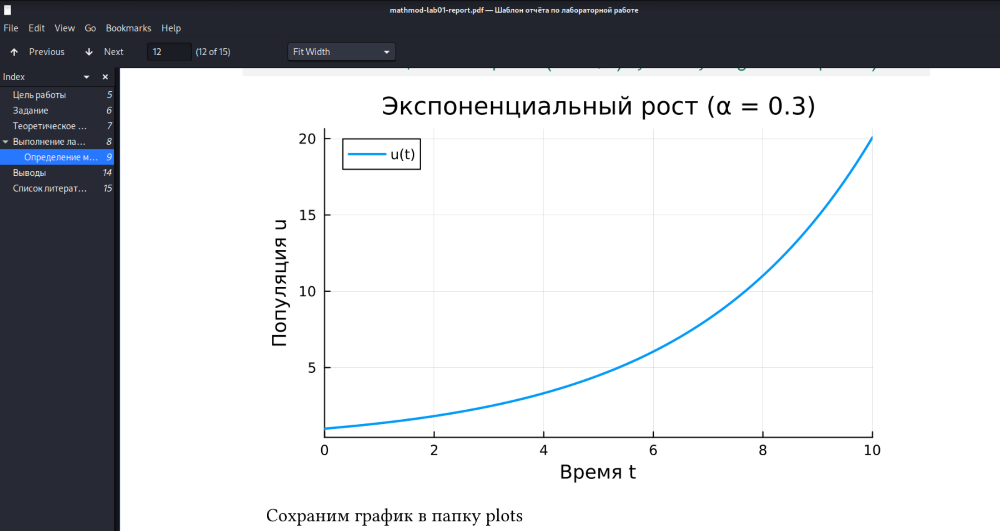{#fig-029 width=70%}

## Модель с параметрами

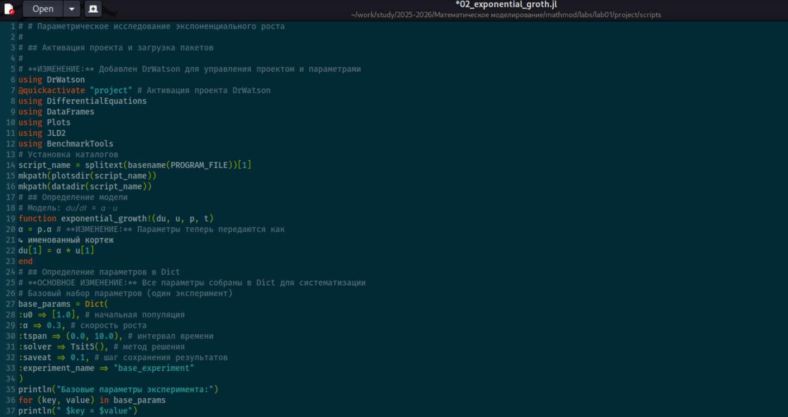{#fig-030 width=70%}

## Модель с параметрами

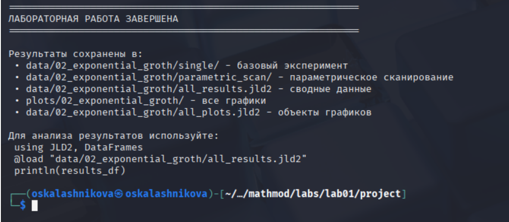{#fig-031 width=70%}

## Модель с параметрами

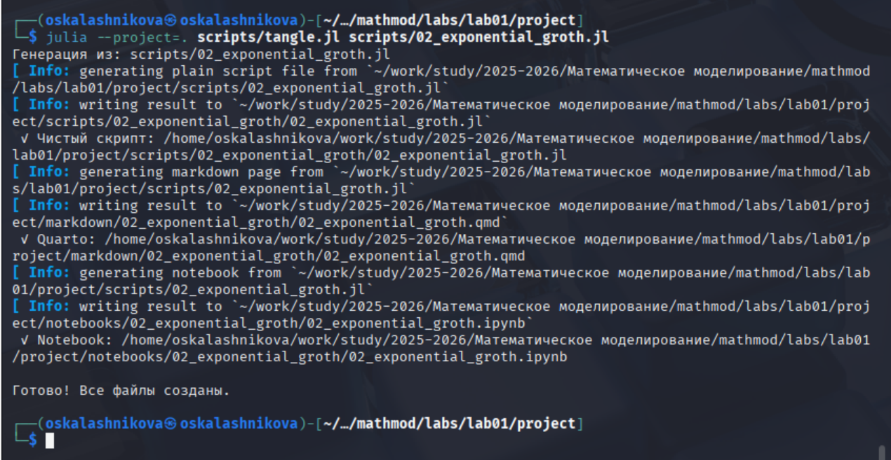{#fig-032 width=70%}

## Модель с параметрами

{#fig-033 width=70%}

## Модель с параметрами

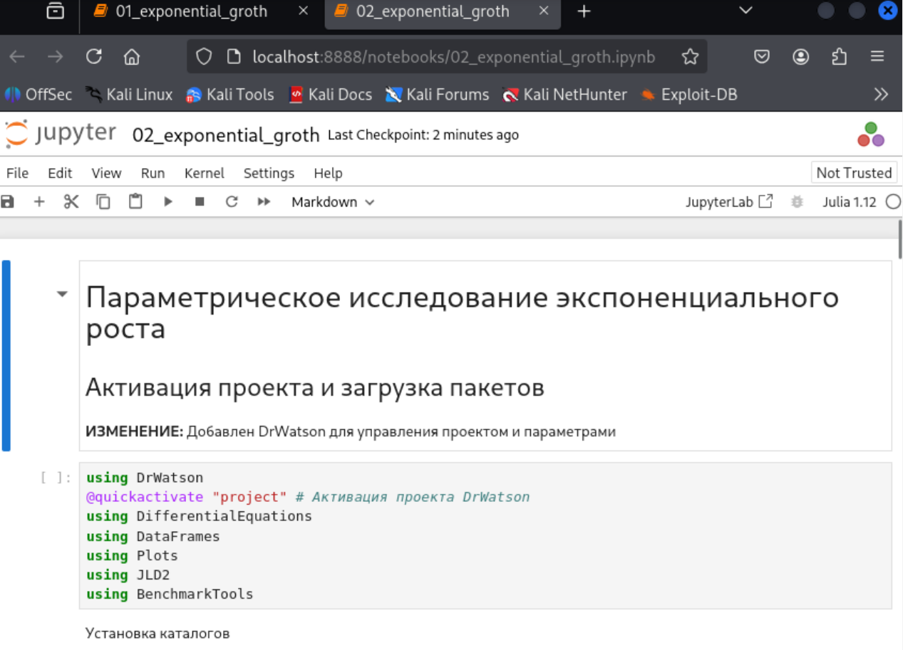{#fig-034 width=60%}

## Модель с параметрами

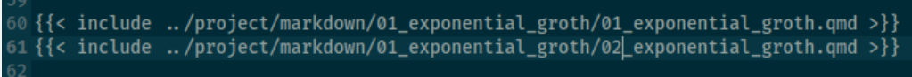{#fig-035 width=70%}

## Модель с параметрами

{#fig-036 width=40%}

## Модель с параметрами

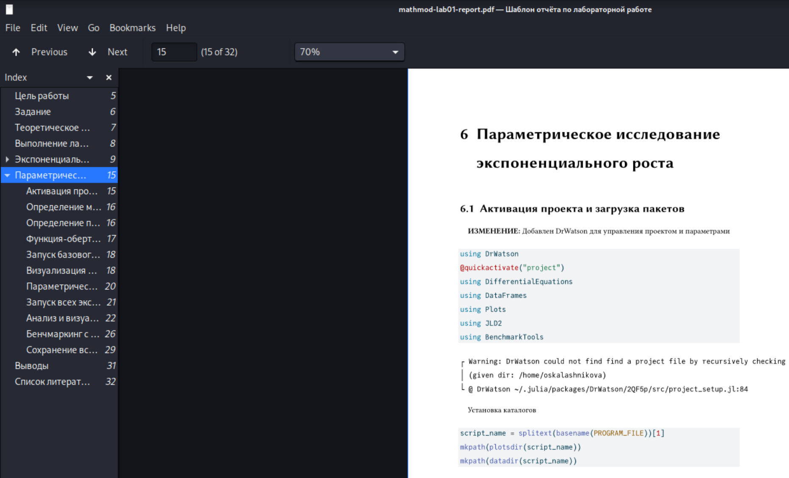{#fig-037 width=70%}

# Подведение итогов

## Выводы

В ходе выполнения лабораторной работы №1 мы подготовили рабочее пространство для выполнения программ и приобрели необходимые навыки создания и преобразования программ на Julia

## Список литературы

1. [Лаборатораня работа №1](https://esystem.rudn.ru/pluginfile.php/3094821/mod_resource/content/1/mathmod-lab.pdf)
