---
## Author
author:
  name: Калашникова Ольга Сергеевна
  degrees: DSc
  orcid: 0000-0002-0877-7063
  email: kulyabov-ds@rudn.ru
  affiliation:
    - name: Российский университет дружбы народов
      country: Российская Федерация
      postal-code: 117198
      city: Москва
      address: ул. Миклухо-Маклая, д. 6

## Title
title: "Отчёт по лабораторной работе №1"
subtitle: "Дисциплина: Математическое моделирование"
license: "CC BY"
---

# Цель работы

Целью данной работы является подготовка рабочего пространства для выполнения программ и приобретение необходимых навыков создания и преобразования программ на Julia

# Задание

1. Создать рабочий каталог для всего курса.
2. Создать рабочее пространство для программ в рамках лабораторной работы.
3. Выполнить все задания по тексту лабораторной работы.
4. Установить необходимые пакеты.
5. Выполнить предложенный код.
6. Преобразовать код в литературный стиль.
7. Сгенерировать из литературного кода:
- чистый код;
- jupyter notebook;
- документацию в формате Quarto.
8. Выполнить код из jupyter notebook.
9. Интегрировать документацию в формате Quarto в отчёт.
10. Добавить в код в литературном стиле вычисление для набора параметров.
11. Сгенерировать из литературного кода с параметрами:
- чистый код;
- jupyter notebook;
- документацию в формате Quarto.
12. Выполнить код из jupyter notebook с параметрами.
13. Интегрировать документацию с параметрами в формате Quarto в отчёт.

# Выполнение лабораторной работы

## Создание проекта DrWatson для лабораторных

Установили в нашей операционной системе julia: ```sudo snap install julia --classic``` ([рис. @fig-001]), ([рис. @fig-002])

{#fig-001 width=70%}

{#fig-002 width=70%}

Перешли в директорию *labs/lab01* ([рис. @fig-003])

{#fig-003 width=70%}

### Создание каталога проекта DrWatson

Далее создали каталога проекта DrWatson через скрипт. Сначала создали файл *setup_project.jl* со следующим содержанием ([рис. @fig-004]), ([рис. @fig-005]):

```
##!/usr/bin/env julia
## setup_project.jl
using Pkg
Pkg.add("DrWatson")
using DrWatson
## Создание проекта
project_name = "project"
initialize_project(project_name; authors="Калашникова Ольга", git=false)
println("✅ Проект создан: ", project_name)
println("� Перейдите в директорию: cd ", project_name)
```

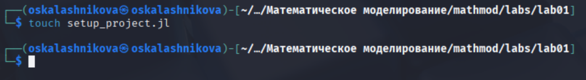{#fig-004 width=70%}

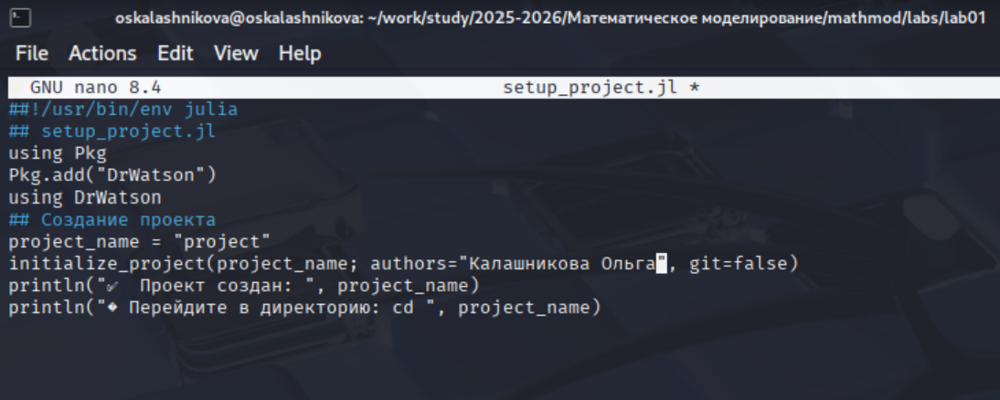{#fig-005 width=70%}

Далее запустили скрипт командой ```julia setup_project.jl``` ([рис. @fig-006])

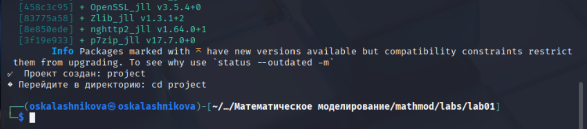{#fig-006 width=70%}

### Добавление необходимых пакетов

Далее добавили необходимые пакеты. Для этого создали файл *add_packages.jl* в корне проекта (```cd project```) следующим содержанием ([рис. @fig-007]), ([рис. @fig-008]):

```
##!/usr/bin/env julia
## add_packages.jl
using Pkg
Pkg.activate(".") # Активируем текущий проект
## ОСНОВНЫЕ ПАКЕТЫ ДЛЯ РАБОТЫ
packages = [
"DrWatson", # Организация проекта
"DifferentialEquations", # Решение ОДУ
"Plots", # Визуализация
"DataFrames", # Таблицы данных
"CSV", # Работа с CSV
"JLD2", # Сохранение данных
"Literate", # Literate programming
"IJulia", # Jupyter notebook
"BenchmarkTools", # Бенчмаркинг
"Quarto" # Создание отчетов
]
println("Установка базовых пакетов...")
Pkg.add(packages)
println("\n✅ Все пакеты установлены!")
println("Для проверки: using DrWatson, DifferentialEquations, Plots")
```

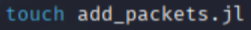{#fig-007 width=70%}

{#fig-008 width=70%}

Далее запустили скрипт командой ```julia add_packages.jl``` ([рис. @fig-009])

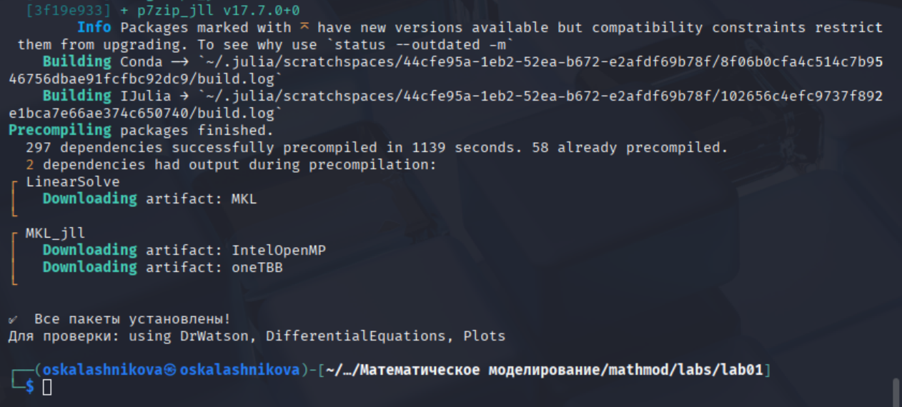{#fig-009 width=70%}

### Проверка установки

Далее проверили установку. Для этого создали файл *scripts/test_setup.jl* следующим содержанием ([рис. @fig-010]), ([рис. @fig-011]):

```
##!/usr/bin/env julia
## test_setup.jl
using DrWatson
@quickactivate "project"
println("✅ Проект активирован: ", projectdir())
## Проверка пакетов
packages = [
"DrWatson", # Организация проекта
"DifferentialEquations", # Решение ОДУ
"Plots", # Визуализация
"DataFrames", # Таблицы данных
"CSV", # Работа с CSV
"JLD2", # Сохранение данных
"Literate", # Literate programming
"IJulia", # Jupyter notebook
"BenchmarkTools", # Бенчмаркинг
"Quarto" # Создание отчетов
]
println("\nПроверка пакетов:")
for pkg in packages
try
eval(Meta.parse("using $pkg"))
println(" ✓ $pkg")
catch e
println(" ✗ $pkg: Ошибка загрузки")
end
end
## Проверка путей
println("\nСтруктура проекта:")
println(" Корень: ", projectdir())
println(" Данные: ", datadir())
println(" Скрипты: ", srcdir())
println(" Графики: ", plotsdir())
```

{#fig-010 width=70%}

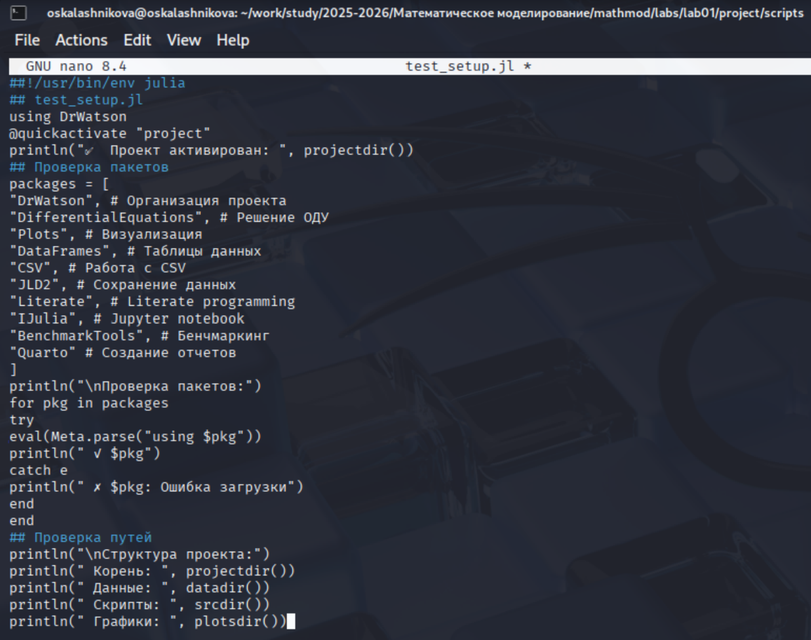{#fig-011 width=70%}

Далее запустили скрипт командой ```julia --project=. scripts/test_setup.jl``` ([рис. @fig-012]), ([рис. @fig-013])

{#fig-012 width=70%}

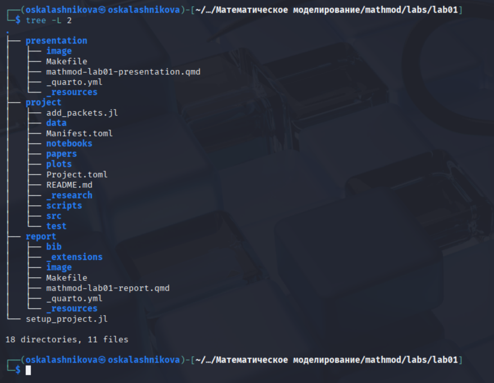{#fig-013 width=70%}

## Модель экспоненциального роста

### Реализация модели

Далее реализовали модель экспоненциального роста. Создали скрипт *scripts/01_exponential_growth.jl* ([рис. @fig-014]), ([рис. @fig-015])

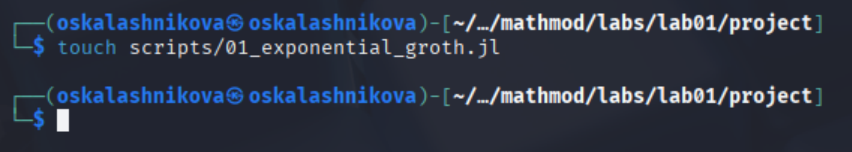{#fig-014 width=70%}

{#fig-015 width=70%}

Далее выполнили скрипт командой ```julia --project=. scripts/01_exponential_growth.jl``` и посмотрели результирующие графики в каталоге *plots/* ([рис. @fig-016]), ([рис. @fig-017])

{#fig-016 width=70%}

{#fig-017 width=70%}

### Литературная реализация модели

Добавили в файл описание в духе литературного программирования. Изменили скрипт *scripts/01_exponential_growth.lj* ([рис. @fig-018])

{#fig-018 width=70%}

Далее снова выполнили скрипт командой ```julia --project=. scripts/01_exponential_growth.jl``` ([рис. @fig-019])

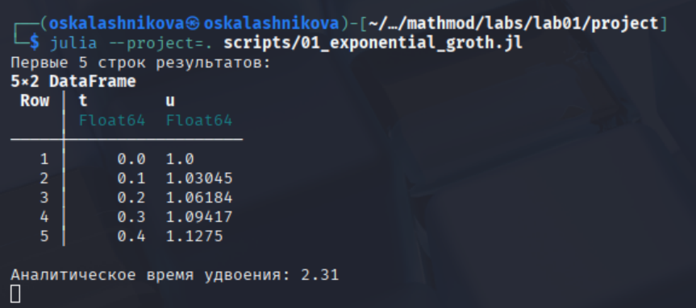{#fig-019 width=70%}

### Создание производных форматов

Далее создали скрипт для генерации производных форматов *scripts/tangle.jl* ([рис. @fig-020]), ([рис. @fig-021])

{#fig-020 width=70%}

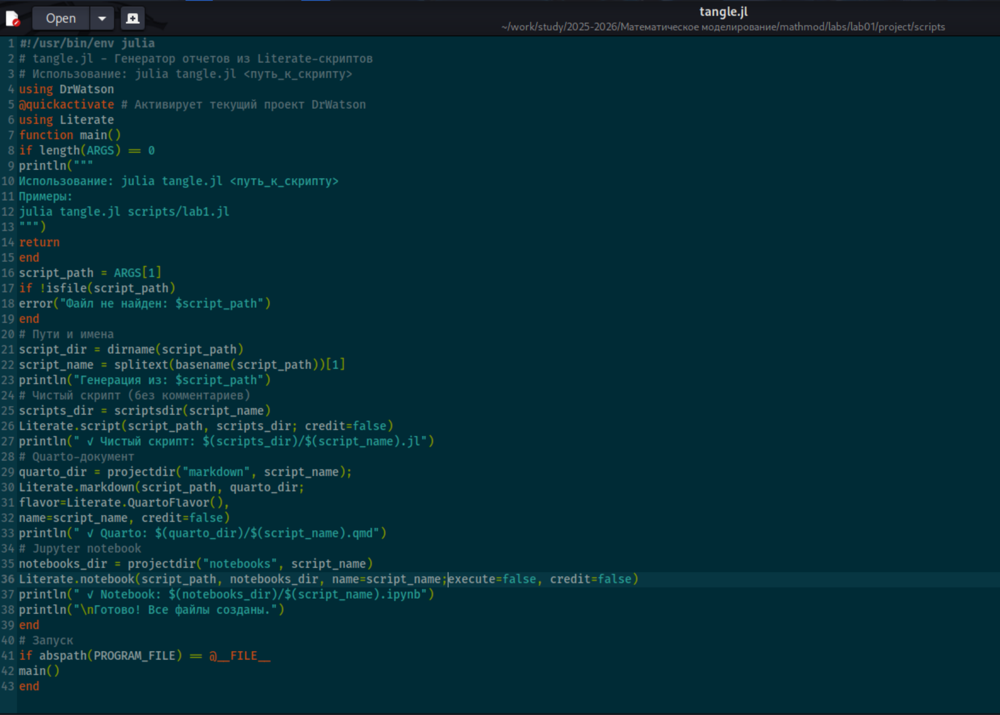{#fig-021 width=70%}

Создали производные форматы: ```julia --project=. scripts/tangle.jl scripts/01_exponential_growth.jl``` ([рис. @fig-022])

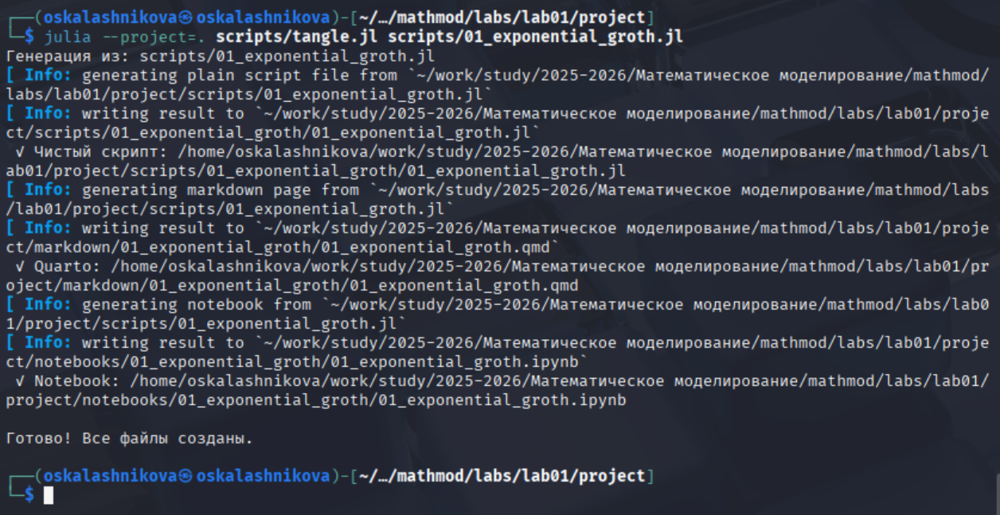{#fig-022 width=70%}

### Jupyter notebook

Далее выполнили Jupyter-ноутбук командой: ```jupyter notebook notebooks/01_exponential_growth/01_exponential_growth.ipynb``` ([рис. @fig-023]), ([рис. @fig-024])

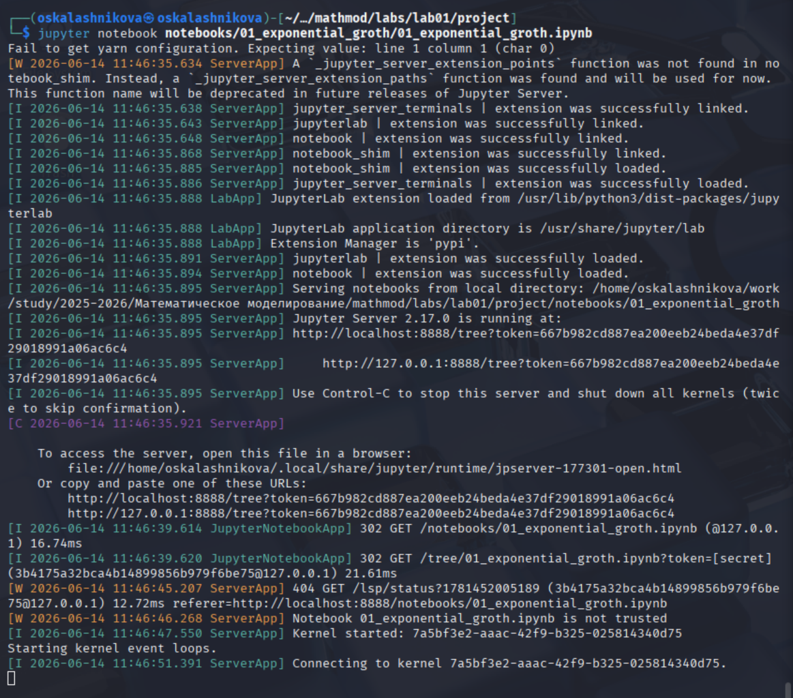{#fig-023 width=70%}

{#fig-024 width=70%}

### Документирование в отчёте

В каталоге отчёта в файл *_quarto.yml* включили поддержку кода julia ([рис. @fig-025]):

```
engine: julia
julia:
	exeflags: ["--project=../project"]
```

{#fig-025 width=70%}

В преамбуле *preamble.tex* подключили пакет juliamono ([рис. @fig-026]):

```
\usepackage[Scale=MatchUppercase]{juliamono}
```

{#fig-026 width=70%}

В файле отчёта после описания выполнения лабораторной работы подключили файл описания программы ([рис. @fig-027])

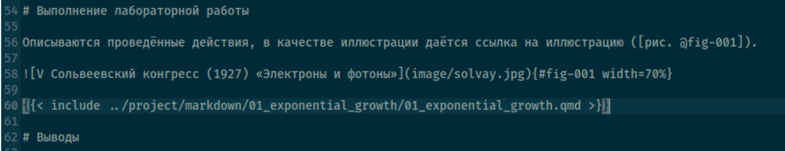{#fig-027 width=70%}

Далее скомпилировал иотчёт ([рис. @fig-028]), ([рис. @fig-029])

{#fig-028 width=70%}

{#fig-029 width=70%}

## Модель с параметрами

### Реализация модели с параметрами

Создали файл с программой *scripts/02_exponential_growth.jl* ([рис. @fig-030])

{#fig-030 width=70%}

Далее выполнили программу командой ```julia --project=. scripts/02_exponential_growth.jl``` ([рис. @fig-031])

{#fig-031 width=70%}

### Создание производных форматов

Создали производные форматы: ```julia --project=. scripts/tangle.jl scripts/02_exponential_growth.jl``` ([рис. @fig-032])

{#fig-032 width=70%}

### Jupyter notebook

Далее выполнили Jupyter-ноутбук командой: ```jupyter notebook notebooks/02_exponential_growth/02_exponential_growth.ipynb``` ([рис. @fig-033]), ([рис. @fig-034])

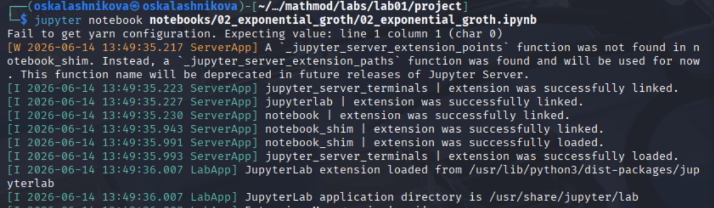{#fig-033 width=70%}

{#fig-034 width=70%}

### Документирование в отчёте

В файле отчёта после описания выполнения лабораторной работы подключили файл описания программы ([рис. @fig-035])

{#fig-035 width=70%}

Скомпилировали отчёт ([рис. @fig-036]), ([рис. @fig-037])

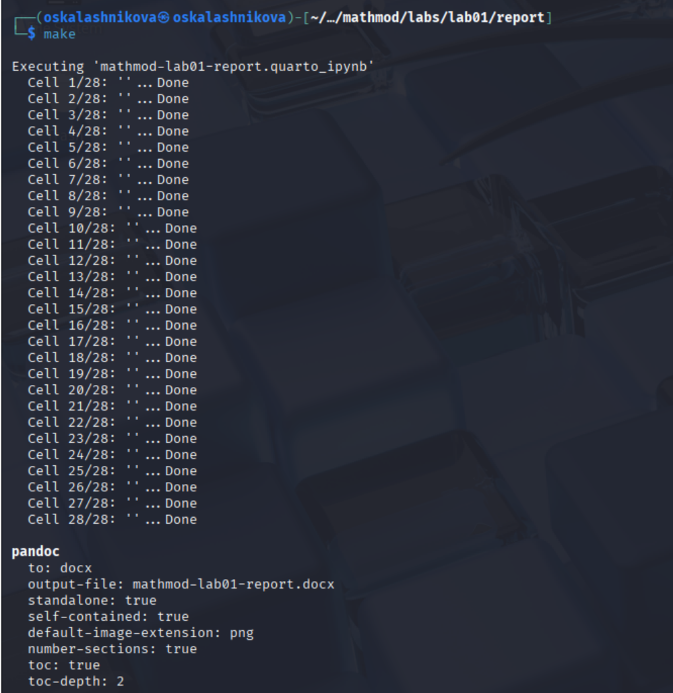{#fig-036 width=70%}

{#fig-037 width=70%}




# Выводы

В ходе выполнения лабораторной работы №1 мы подготовили рабочее пространство для выполнения программ и приобрели необходимые навыки создания и преобразования программ на Julia

# Список литературы

1. [Лаборатораня работа №1](https://esystem.rudn.ru/pluginfile.php/3094821/mod_resource/content/1/mathmod-lab.pdf)
