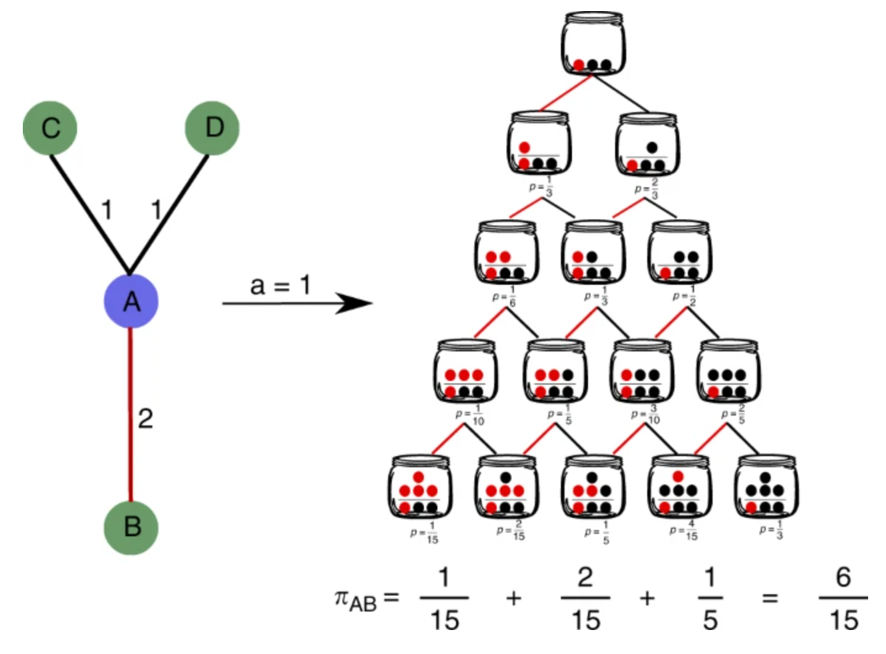

---
# Preamble

## Author
author:
  name: Калашникова Ольга Сергеевна
  degrees: Student
  orcid:
  email: 1132231846@pfur.ru
  affiliation:
    - name: Российский университет дружбы народов
      country: Российская Федерация
      postal-code: 117198
      city: Москва
      address: ул. Миклухо-Маклая, д. 6
## Title
title: "Доклад"
subtitle: "Зависимость от пути"
license: "CC BY"
## Generic options
lang: ru-RU
number-sections: true
toc: true
toc-title: "Содержание"
toc-depth: 2
## Crossref customization
crossref:
  lof-title: "Список иллюстраций"
  lot-title: "Список таблиц"
  lol-title: "Листинги"
## Bibliography
bibliography:
  - bib/cite.bib
csl: _resources/csl/gost-r-7-0-5-2008-numeric.csl
## Formats
format:
### Pdf output format
  pdf:
    toc: true
    number-sections: true
    colorlinks: false
    toc-depth: 2
    lof: true # List of figures
    lot: true # List of tables
#### Document
    documentclass: scrreprt
    papersize: a4
    fontsize: 12pt
    linestretch: 1.5
#### Language
    babel-lang: russian
    babel-otherlangs: english
#### Biblatex
    cite-method: biblatex
    biblio-style: gost-numeric
    biblatexoptions:
      - backend=biber
      - langhook=extras
      - autolang=other*
#### Misc options
    csquotes: true
    indent: true
    header-includes: |
      \usepackage{indentfirst}
      \usepackage{float}
      \floatplacement{figure}{H}
      \usepackage[math,RM={Scale=0.94},SS={Scale=0.94},SScon={Scale=0.94},TT={Scale=MatchLowercase,FakeStretch=0.9},DefaultFeatures={Ligatures=Common}]{plex-otf}
### Docx output format
  docx:
    toc: true
    number-sections: true
    toc-depth: 2
---

# Вводная часть

**Актуальность темы и проблема:** в классической теории вероятностей широко используются предположения о независимости испытаний или марковском свойстве, согласно которому будущее зависит только от текущего состояния. Однако в реальных процессах — эволюции технологий, распространении информации, формировании социальных норм, развитии экономических институтов — будущее во многом определяется тем, какой именно путь был пройден в прошлом. Небольшое случайное событие на раннем этапе может закрепиться под действием положительной обратной связи и привести к необратимому исходу, который невозможно предсказать, исходя только из текущего состояния системы. Это явление получило название зависимости от пути (path dependence). Непонимание этого механизма ведёт к серьёзным ошибкам при прогнозировании и интерпретации статистических данных, поскольку классические методы, основанные на предположении об эргодичности, могут давать неверные результаты для систем с положительной обратной связью.

**Объект и предмет исследования:** вероятностные модели с зависимостью от пути, а именно модифицированная урновая модель, в которой вероятность вынуть шар того или иного цвета зависит от всей предыдущей истории извлечений.

**Цель:** цель данного доклада — раскрыть понятие зависимости от пути (path dependence), изучить его математическую формализацию на основе урновых моделей и выявить ключевые отличия от классических марковских и эргодических процессов.

**Задачи исследования:** Представить математическое описание зависимости от пути с помощью урновой модели.

**Материалы и методы и инструменты исследования:** интернет-ресурсы, аналитика

# Введение

В классической теории вероятностей широко используются два основных предположения о характере случайных процессов. Первое — это независимость испытаний, когда исход каждого следующего события никак не связан с предыдущими. Второе — марковское свойство, согласно которому будущее состояние системы зависит только от её текущего состояния, но не от того, каким образом это состояние было достигнуто. Эти предположения удобны с математической точки зрения и лежат в основе многих стандартных моделей.

Однако в реальных процессах зависимость от прошлого часто оказывается гораздо глубже. В эволюции технологий, распространении информации, формировании социальных норм или развитии экономических институтов будущее во многом определяется тем, какой именно путь был пройден в прошлом. Небольшое случайное событие на раннем этапе может закрепиться под действием положительной обратной связи и привести к необратимому исходу, который невозможно предсказать, исходя только из текущего состояния системы. Это явление получило название зависимости от пути (path dependence).

Классическим примером зависимости от пути является расположение клавиш на клавиатуре QWERTY. Эта раскладка была разработана в 1870-х годах для механических печатных машинок. Её цель заключалась не в максимизации скорости печати, а в замедлении набора, чтобы предотвратить залипание рычажков с литерами. Наиболее удобные и частые буквенные сочетания были намеренно разнесены по разным сторонам клавиатуры.

Позднее были созданы более эргономичные раскладки, например Dvorak, которые позволяют печатать быстрее и с меньшей утомляемостью. Однако к тому времени раскладка QWERTY уже была массово внедрена. Миллионы людей обучились печатать именно на ней, производители выпускали клавиатуры только с этой раскладкой, а машинистки, владевшие QWERTY, были более востребованы на рынке труда. Несмотря на объективные преимущества альтернативных раскладок, победила та, которая случайно закрепилась на раннем этапе развития технологий. Исход конкуренции был определён не качеством раскладки, а исторической случайностью и эффектом положительной обратной связи: чем больше людей использовали QWERTY, тем выгоднее было новым пользователям также осваивать именно её.

Математическое моделирование таких процессов требует отказа от стандартных предположений об эргодичности и марковости. Вместо этого необходимо строить модели, в которых будущее явным образом зависит от всей предшествующей истории. Удобным инструментом для этого служат урновые модели (urn models). В простейшем варианте урна содержит белые и чёрные шары. На каждом шаге шар вынимается, возвращается обратно, и дополнительно добавляется несколько шаров того же цвета. В результате вероятность вынуть белый шар возрастает с каждым новым белым шаром. Такая механика наглядно демонстрирует, как случайные события на ранних этапах могут необратимо зафиксировать долгосрочный исход: система может прийти к доминированию белых или чёрных шаров в зависимости от того, какой путь был пройден.

Непонимание механизма зависимости от пути ведёт к серьёзным ошибкам при прогнозировании и интерпретации статистических данных. Классические методы, основанные на предположении об эргодичности, могут давать неверные результаты для систем с положительной обратной связью. Среднее значение по множеству траекторий может не соответствовать поведению ни одной отдельной траектории, а попытки усреднить случайность приводят к ложному выводу о предсказуемости процесса.

Таким образом, чёткое представление о том, как прошлое влияет на будущее в вероятностных моделях, является необходимым условием корректного математического моделирования сложных систем. В данном докладе рассматривается модифицированная урновая модель, в которой вероятность вынуть шар того или иного цвета зависит от всей предыдущей истории извлечений. Анализируются свойства этой модели, приводятся численные примеры и обсуждаются области применения в теории вероятностей и математической статистике.

# Описание базовой модели

## Пространство эксперимента и обозначения

- Время дискретно: $n = 0, 1, 2, \dots$
- Начальное состояние урны: $a$ белых и $b$ чёрных шаров, где $a, b \ge 0$ и $a + b > 0$
- Переменные:
  - $X_k \in \{0,1\}$ — индикатор исхода $k$-го извлечения: $X_k = 1$ обозначает белый шар, $X_k = 0$ — чёрный
  - $H_n = (X_1, \dots, X_n)$ — полная история наблюдений до момента $n$
  - $S_n = \sum_{k=1}^n X_k$ — суммарное число белых в первых $n$ испытаниях
  - $W_n, B_n$ — текущее число белых и чёрных шаров в урне сразу после $n$-го шага (т.е. до $(n+1)$-го извлечения)

## Правила эволюции урны

- На каждом шаге извлекается шар случайно пропорционально их текущим количествам (без дополнительной внешней помехи)
- После наблюдения цвета шар возвращается в урну вместе с $c \ge 0$ дополнительными шарами того же цвета ($c$ — целое $\ge 0$, часто $c = 1$)
- Отличие от классической модели: вероятность белого на шаге $n+1$ задаётся функцией не только от $W_n$ и $B_n$, но и от всей истории $H_n$ (или эквивалентно от $S_n$ и, возможно, других статистик порядка)

## Связь $W_n, B_n$ и $S_n$

Если при каждом белом извлечении добавляют $c$ шаров белого цвета, а при каждом чёрном — $c$ шаров чёрного цвета, то

$$W_n = a + c \cdot S_n$$

$$B_n = b + c \cdot (n - S_n)$$

Тогда в классической модели вероятность белого на следующем шаге равна:

$$\frac{W_n}{W_n + B_n} = \frac{a + c S_n}{a + b + c n}$$

Эта вероятность зависит от $S_n$, но не от порядка извлечений, и при фиксированном $c$ отражает только итоговые счёты.

## Что значит «зависимость от пути» в этой постановке

- В классической постановке поведение процесса определяется только текущими счётчиками $(W_n, B_n)$ — порядок событий, приведший к этим счётчикам, не имеет значения для будущих переходов
- В модели с зависимостью от пути переходная вероятность может учитывать, например, структуру порядка (ранние успехи сильнее влияют, чем поздние), весовые суммы прошлых исходов или иные функции $H_n$. Практически это означает, что состояние процесса должно включать историю или специальные её резюме (например, $S_n$ и дополнительные счётчики ранних этапов), чтобы корректно описать дальнейшую динамику

# Формальная запись вероятностей и параметризация 

## Общая форма и мотивация

Предлагаемая параметризация:

$$P(X_{n+1}=1 \mid H_n) = \frac{W_n + \alpha \cdot S_n + \delta}{W_n + B_n + \beta \cdot n + \gamma}$$

**Мотивация выбора такого вида:**

- **Числитель:** $W_n$ отражает непосредственный вклад текущего состава; добавочный член $\alpha \cdot S_n$ усиливает влияние накопленного числа белых — это явный «член памяти». Константа $\delta$ моделирует априорный эффект (сглаживание).
- **Знаменатель:** нормировка по сумме шаров $W_n + B_n$ дополнена $\beta \cdot n$ (позволяет масштабировать вклад истории относительно линейного роста числа испытаний) и $\gamma$ — дополнительные априорные стабилизаторы.

Такая форма сохраняет интерпретацию в терминах «эффективного счёта белых / общего эффективного счёта», что удобно для интуиции и некоторых аналитических приёмов.

## Интерпретация параметров

- **$\alpha \ge 0$ — параметр памяти**
  - $\alpha = 0$ → отсутствует специальная зависимость от истории помимо того, что уже присутствует через $W_n$; модель сводится к классической или близкой к ней форме.
  - $\alpha > 0$ → каждый прошлый белый даёт дополнительный «бонус» в числителе, т.е. прошлые события усиливают вероятность будущих белых сверх простого учёта количества шаров.
  - Чем больше $\alpha$, тем сильнее положительная обратная связь; при больших $\alpha$ ранние случайные флуктуации быстро накапливаются и приводят к фиксации.

- **$\beta \ge 0$ — нормализующий коэффициент в знаменателе**
  - Позволяет контролировать, как «быстро» растёт общий знаменатель по сравнению с вкладом $\alpha \cdot S_n$. Если $\beta$ большое, то относительный вклад $\alpha \cdot S_n$ с ростом $n$ уменьшается (исторический эффект «размывается»).
  - $\beta$ также даёт возможность моделировать временную «убывающую память»: при $\beta > 1$ влияние истории по сравнению с линейным ростом числа испытаний уменьшается.

- **$\delta, \gamma \ge 0$ — априорные (сглаживающие) параметры**
  - Убирают вырождение при малых $n$: если $a = 0$ и $S_n = 0$, без $\delta$ вероятность белого может быть нулевой; $\delta$ даёт «маленький запас» вероятности.
  - Эффект похож на добавление псевдонаблюдений (Bayesian smoothing): модель остаётся устойчивой при малой выборке.

- **$c$ (неявно в $W_n$ и $B_n$) — масштаб добавления шаров**
  - Если $c \neq 1$, то $W_n = a + c S_n$ и $B_n = b + c (n - S_n)$; $c$ влияет на базовую скоростную шкалу роста чисел шаров.
  - В предложенной формуле $c$ интегрируется в $W_n$ и $B_n$; часто удобнее рассматривать $c = 1$ для упрощения аналитики.

## Упрощённая форма и пределы

При $c = 1$, $\beta = 1$, $\delta = \gamma = 0$ упрощаем до:

$$P(X_{n+1}=1 \mid H_n) = \frac{a + (1 + \alpha) S_n}{a + b + n + \alpha S_n}$$

**Пояснения:**

- В числителе видно, что прошлые белые дают коэффициент $(1 + \alpha)$ вместо $1$ в классическом случае.
- В знаменателе добавочный $\alpha S_n$ сохраняет баланс: при росте $S_n$ общий знаменатель также увеличивается, но относительный вес белых растёт быстрее при $\alpha > 0$.
- Если $\alpha = 0$, мы получаем классическую модель: $\displaystyle P = \frac{a + S_n}{a + b + n}$.

## Альтернативные интерпретации формулы

- **Байесовская интуиция:** числитель и знаменатель можно рассматривать как «эффективные» числа белых и всех шаров, причём $\alpha \cdot S_n$ добавляет к числителю дополнительный вклад, словно каждое прошлое белое даёт некоторую «память», учитываемую повторно при выборе.
- **Процесс с подкреплением:** вероятность белого увеличивается не только потому, что в урне стало больше белых (это классическое подкрепление), но и потому, что сама история даёт дополнительное подкрепление (мета‑подкрепление).

## Пояснения по корректности и ограничениям параметров

- Требование $0 \le P(\cdot) \le 1$ накладывает естественные ограничения на параметры (в частности, положительность всех числителей и знаменателей). С учётом неотрицательности $a, b, c$ и параметров $\alpha, \beta, \delta, \gamma$ это условие обеспечивается.
- Параметры $\alpha$ и $\beta$ должны подбираться с учётом интерпретации: очень большие $\alpha$ без соответствующего $\beta$ приводят к быстрой фиксации и могут быть нереалистичны для моделирования «мягкой» памяти.
- При выборе параметров важно учитывать масштаб $n$: если $\beta = 0$, вклад $\alpha \cdot S_n$ растёт как $O(n)$ и будет доминировать знаменатель; при $\beta > 0$ можно достичь балансировки.

# Частные случаи и связь с моделью Пойя

## Классическая модель Пойя (возвращение как частный случай)

Пусть $\alpha = 0$, $\delta = \gamma = 0$, $c = 1$. Тогда:

$$P(X_{n+1}=1 \mid H_n) = \frac{a + S_n}{a + b + n}$$

**Особенности:**

- Вероятность зависит только от суммарного счёта $S_n$ (а следовательно, эквивалентно от текущего состава $W_n, B_n$), но не от порядка извлечений.
- $M_n = \frac{a + S_n}{a + b + n}$ — мартингал (при $c = 1$). По теореме о мартингалах $M_n$ сходится почти наверное к $M_\infty$.
- Распределение предела $M_\infty$ при классических условиях — $\text{Beta}(a, b)$ (если смотреть на правильные масштабы и нормировки; при $c \neq 1$ — $\text{Beta}(a/c, b/c)$ и т.п.).
- **Пример:** $a = b = 1$, $c = 1$ → начальная урна «нейтральна», $M_\infty$ имеет равномерное распределение на $(0,1)$ в классическом случае.

## Общая Пойя‑урна с $c \neq 1$ ($\alpha = 0$)

При $\alpha = 0$, но произвольном $c$ (каждый выбранный шар приводит к добавлению $c$ шаров того же цвета):

$$M_n = \frac{a + c S_n}{a + b + c n}$$

Многие результаты классической Пойя‑урны сохраняются, но с изменёнными формулами для моментов и предельных распределений (ради $c$). В частности, мартингал работает для соответствующих нормировок, и $M_\infty$ имеет Beta‑тип распределение с параметрами $a/c$ и $b/c$.

## Малые $\alpha > 0$: «мягкая» память

Если $\alpha > 0$ но малое ($\alpha \ll 1$), то:

- На начальных шагах влияние $\alpha \cdot S_n$ невелико; процесс ведёт себя подобно классической урне в среднем.
- Однако роль $\alpha$ проявляется в накопительной динамике: небольшие отличия в последовательности извлечений на раннем этапе будут давать уклон, который с ростом $n$ может увеличиваться, хотя и медленнее, чем при больших $\alpha$.
- При анализе асимптотики для малых $\alpha$ часто можно использовать разложение по малому параметру $\alpha$ (первые члены дают поправки к классическому поведению).

**Пример:** $a = b = 1$, $c = 1$, $\alpha = 0.1$. Симуляции покажут, что для умеренных $n$ ($100$–$1000$) поведение близко к Пойе, но вариативность траекторий становится слегка больше, и вероятность достижения крайних значений ($M_n$ близко к $0$ или $1$) немного возрастает по сравнению с $\alpha = 0$.

## Большие $\alpha$: жёсткая позитивная обратная связь и фиксация

При больших $\alpha$:

- Термин $\alpha \cdot S_n$ доминирует в числителе и знаменателе уже при относительно небольших $n$, поэтому начальные флуктуации значительно усиливаются.
- **Следствие:** высокая вероятность фиксации — процесс с ненулевой вероятностью будет стремиться к одному из поглощающих состояний (доминирование одной группы): $M_n \to 1$ или $M_n \to 0$.
- **Интерпретация:** модель описывает системы, в которых «ранние лидеры» получают непропорциональный бонус, после чего возврат к конкурентному состоянию затруднён.

**Пример:** при $\alpha = 10$ с $a = b = 1$ первые $5$–$10$ шагов практически определяют дальнейшее развитие: если к этому моменту белые имеют хоть небольшое преимущество, вероятность их окончательного доминирования очень велика.

# Пример фильтрации сетей

Для наглядной демонстрации того, как урновая модель с зависимостью от пути применяется в реальных задачах, рассмотрим подход для фильтрации статистически значимых связей в сложных сетях.

## Постановка задачи

Рассматривается взвешенная сеть (например, транспортная или экономическая). Для каждого узла известны:

- степень \(k\) — число его связей,
- сила \(s\) — суммарный вес всех его связей,
- вес \(w\) конкретной анализируемой связи.

Вопрос: является ли связь с весом \(w\) статистически значимой или она могла возникнуть случайно?

## Урновая аналогия

Предлагается следующая интерпритация [рис. @fig-001]). Для узла A с \(k = 3\) и \(s = 4\) анализируется связь с \(w = 2\):

- В урну изначально помещается **1 красный шар** (анализируемая связь) и \(k - 1 = 2\) **чёрных шара** (остальные связи).
- Общее число извлечений равно силе узла: \(s = 4\).
- Параметр усиления \(a = 1\) (классическая модель Пойя: после извлечения добавляется один шар того же цвета).

{#fig-001 width=70%}

## Вероятностная формула

Вероятность вынуть ровно \(w\) красных шаров за \(s\) извлечений задаётся бета-биномиальным распределением:

$$
\mathbb{P}(w \mid k, s, a) = \binom{s}{w} \frac{B\left(\frac{1}{a} + w,\; \frac{k-1}{a} + s - w\right)}{B\left(\frac{1}{a},\; \frac{k-1}{a}\right)},
$$

где \(B(\cdot, \cdot)\) — бета-функция.

**P-value** для связи вычисляется как сумма вероятностей всех исходов, в которых урна содержит **не менее \(w\) красных шаров** (помимо изначального):

$$
\pi_P(w \mid k, s, a) = 1 - \sum_{x=0}^{w-1} \mathbb{P}(x \mid k, s, a).
$$

## Связь с зависимостью от пути

Этот пример наглядно демонстрирует ключевые свойства **зависимости от пути** в урновых моделях:

1. **Положительная обратная связь:** каждый вынутый красный шар увеличивает вероятность вынуть красный снова (за счёт добавления новых шаров того же цвета).

2. **Немарковость:** вероятность будущих исходов зависит не только от текущего состава урны, но и от всей предыдущей истории извлечений. Две разные последовательности, приведшие к одному составу, могут давать разное распределение будущих исходов.

3. **Фиксация:** при $a > 0$ ранние случайные флуктуации могут необратимо зафиксировать доминирование одного цвета — в сетевом контексте это означает, что случайно возникшая связь может закрепиться и стать доминирующей.

В отличие от подходов, основанных на предположении о случайном распределении весов (например, гипергеометрический фильтр), модель Пойя естественным образом учитывает эффект самоусиления — свойство, присущее большинству реальных сетей (социальных, транспортных, экономических), где «прошлые взаимодействия увеличивают вероятность будущих взаимодействий».

Параметр $a$ в этой модели играет ту же роль, что и параметр $\alpha$ в параметризации (раздел 4.2): он управляет силой положительной обратной связи. При $a = 0$ модель сводится к биномиальному распределению (отсутствие памяти), при $a = 1$ — к классической модели Пойя, при $a \to \infty$ — к детерминированной фиксации по первому исходу.

# Сравнение с альтернативными подходами к моделированию зависимости от пути

Хотя урновая модель с памятью даёт наглядную и аналитически прозрачную формализацию path dependence, существуют и другие математические подходы, каждый из которых имеет свою область применения и ограничения. Кратко рассмотрим три основных альтернативы.

Модели с пороговыми эффектами (threshold models)

В таких моделях зависимость от пути возникает только после превышения некоторого порога накопленного преимущества. Например, в экономике внедрение технологии может стать необратимым, если доля её пользователей превысила критическое значение $\theta \in (0,1)$. До достижения порога система может колебаться между состояниями, после чего «защелкивается». В отличие от урновой модели с $\alpha > 0$, где положительная обратная связь действует непрерывно и мягко, пороговые модели дают **разрывное поведение**: ниже порога — эргодичность или равновесие, выше — детерминированная фиксация. Недостаток: необходимость априорно задавать порог, который в реальных процессах часто неизвестен или сам зависит от истории.

Кумулятивные процессы (reinforcement learning models)

Широко используются в теории обучения и поведенческой экономике. Вероятность выбора действия $i$ на шаге $n+1$ задаётся как

$$P(i \mid H_n) = \frac{\exp(\beta \cdot Q_i(n))}{\sum_j \exp(\beta \cdot Q_j(n))},$$

где $Q_i(n)$ — кумулятивное вознаграждение за действие $i$ (аналог $S_n$ в урновой модели), а $\beta$ — параметр «рациональности» (обратная температура). При $\beta \to \infty$ модель становится детерминированной, при $\beta \to 0$ — равновероятной. Преимущество: гибкость учёта разных весов прошлых исходов (например, дисконтирование). Недостаток: отсутствие прямой интерпретации в терминах «физического» состава урны, более сложный анализ сходимости.

Марковские процессы с меняющейся матрицей переходов

Классический марковский процесс имеет фиксированную матрицу переходов $P$. В обобщении допускают, что $P$ зависит от времени или от накопленной статистики: $P_{ij}(n) = f_{ij}(S_n, n)$. Например, вероятность перехода в состояние «белый» может расти с каждым посещённым белым состоянием. Такая модель формально ближе к урновой, но сохраняет марковское свойство **расширенного состояния** $(X_n, S_n)$. Однако в ней, как правило, трудно задать параметрическую форму $f_{ij}$, сохраняющую вероятностную корректность и интерпретируемость. Урновая модель оказывается частным случаем такой параметризации с естественной нормировкой.

# Ограничения модели

Предложенная урновая модель зависимости от пути обладает важными достоинствами, однако для корректного применения необходимо чётко понимать её ограничения и базовые допущения.

Прежде всего, модель работает в дискретном времени, где каждый шаг соответствует одному извлечению и добавлению шаров. Это удобно для анализа последовательных событий, но не подходит для непрерывных процессов, таких как физическая диффузия, изменение концентраций в реальном времени или финансовые потоки с неравномерной интенсивностью.

Далее, параметры модели — $\alpha$, $\beta$, $\delta$ и $\gamma$ — являются феноменологическими, то есть не выводятся из первых принципов или микроскопических свойств системы. Например, параметр памяти $\alpha$ задаёт силу положительной обратной связи, но не объясняет, почему в конкретном технологическом или социальном процессе он должен быть равен именно $0.3$, а не $0.7$. На практике эти параметры приходится оценивать статистически по данным, что требует достаточно больших выборок.

Модель также не учитывает антагонистические (конкурентные) взаимодействия, при которых рост одного компонента активно подавляет другой быстрее, чем это следует из простого перераспределения вероятностей через нормировку. В реальных экосистемах, экономике или социальных процессах такие эффекты встречаются часто, и для их описания потребовалась бы более сложная нелинейная модификация.

Кроме того, модель предполагает полную наблюдаемость всей истории извлечений $H_n = (X_1,\dots,X_n)$, тогда как в реальных задачах данные могут быть неполными, агрегированными или зашумлёнными.

Ещё одно важное ограничение связано с объёмом данных. Из-за положительной обратной связи траектории модели обладают высокой дисперсией и склонностью к фиксации, поэтому для устойчивого оценивания параметров и надёжного различения $\alpha = 0$ и $\alpha > 0$ требуется достаточно длинная реализация — как правило, тысячи шагов. При коротких временных рядах (например, менее 50 наблюдений) выводы о наличии зависимости от пути следует делать с большой осторожностью.

Наконец, модель исходит из того, что параметры остаются неизменными на всём протяжении процесса, тогда как в реальности сила памяти или интенсивность подкрепления могут эволюционировать со временем.

Все перечисленные ограничения не обесценивают модель, но задают чёткие границы её применимости. В рамках этих допущений она даёт корректные и интерпретируемые результаты, а при выходе за эти границы требуется либо её модификация, либо использование альтернативных подходов.

# Выводы

Таким образом, зависимость от пути (path dependence) представляет собой фундаментальное свойство неэргодических вероятностных процессов, в котором будущее состояние системы определяется не только текущей конфигурацией, но и всей предшествующей историей развития. В отличие от классических марковских процессов, где будущее зависит только от настоящего, модели с положительной обратной связью демонстрируют необратимость исходов: небольшие случайные события на ранних этапах могут закрепиться и привести к доминированию одного из состояний, как это произошло в примере с клавиатурой QWERTY.

Модифицированная урновая модель Пойя с предложенной параметризацией

$$
P\left( X_{n + 1} = 1 \mid H_{n} \right) = \frac{W_{n} + \alpha \cdot S_{n} + \delta}{W_{n} + B_{n} + \beta \cdot n + \gamma}
$$

выступает эффективным математическим аппаратом для формализации зависимости от пути. Параметр памяти $\alpha \geq 0$ управляет силой положительной обратной связи: при $\alpha = 0$ модель сводится к классической урне Пойя, при $\alpha > 0$ возникает явная зависимость от всей предыдущей истории, а при больших $\alpha$ наступает быстрая фиксация доминирующего состояния.

Несмотря на то, что модель обладает рядом ограничений (дискретность времени, феноменологический характер параметров, необходимость длинных временных рядов для надёжного статистического вывода), понимание механизмов зависимости от пути остаётся критически важным для корректного моделирования сложных систем в экономике, социологии, теории обучения и сетевом анализе, где классические эргодические методы могут давать систематически неверные результаты.

# Список литературы{.unnumbered}

::: {#refs}
::: 
